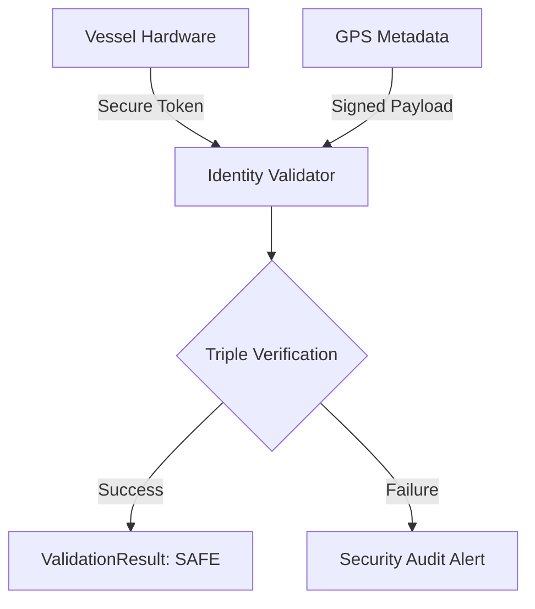

# Ojo de Paz: Arquitectura de Identidad Digital para la Seguridad Marítima Civil

> **Cerrando la brecha entre la seguridad operativa y la verificación digital para la protección de la vida humana.**

---

## 1. EL DIAGNÓSTICO (El "Dolor" Real)

En las zonas de exclusión y control de tráfico marítimo, la falta de identificación electrónica en embarcaciones menores genera falsos positivos en los sistemas de vigilancia automatizada (drones/IA). Para un pescador artesanal, no ser identificado correctamente no es un error administrativo, es un riesgo de vida.

## 2. LA SOLUCIÓN (Propuesta Técnica)

**Ojo de Paz** es un protocolo de Confianza Cero (Zero Trust) que dota a la embarcación de una identidad digital inalterable sin depender de equipos militares costosos.

*   **Atestación de Hardware**: Uso de chips criptográficos de bajo costo para firmar la posición GPS.
*   **Validación de Integridad**: Un motor de reglas (implementado en Java) que verifica en tiempo real que los datos no han sido manipulados ni grabados (anti-replay).
*   **Soberanía de Datos**: Sistema diseñado para ser operado por autoridades locales u ONGs, garantizando que el pescador sea visto como un civil legítimo.

## 3. DIFERENCIACIÓN (Por qué esto y no lo de siempre)

A diferencia del AIS convencional —fácilmente clonable y costoso—, **Ojo de Paz** se enfoca en la prueba de humanidad.

*   **Bajo Costo**: Implementable con hardware comercial y software de código abierto.
*   **Rigor Operativo**: Diseñado desde la experiencia en seguridad de infraestructuras críticas, donde el error no es una opción.

## 4. OBJETIVO DEL LLAMADO

Buscamos establecer un Plan Piloto en comunidades pesqueras del Caribe/Pacífico para validar la reducción de incidentes por identificación errónea y fortalecer la paz territorial mediante tecnología transparente.

---

### 🏗 Architecture Overview



---

---

## 🚀 Quick Start (Usage Example)

Para integrar la validación en tu flujo de datos, utiliza el `MaritimeIdentityValidator`:

```java
try {
    MaritimeIdentityValidator validator = new MaritimeIdentityValidator();
    VesselData vesselData = new VesselData("ID-P-456", "OJO_DE_PAZ_V1", gpsMetadata, signature);
    
    ValidationResult result = validator.validateMaritimeIdentity(vesselData);
    
    if (result.isValid()) {
        System.out.println("✅ Embarcación Verificada: SAFE");
    } else {
        System.out.println("🚨 Alerta de Seguridad: " + result.getMessage());
    }
} catch (NoSuchAlgorithmException e) {
    // Manejo de error de configuración criptográfica
}
```

## 📋 Requisitos & Compilación
- **JDK 11+**
- **Maven 3.6+**

```bash
# Compilar el proyecto
mvn clean compile

# Ejecutar auditoría (placeholder para Fase 2)
mvn test
```

---

### 📧 Sobre el Autor

**Héctor Enrique** - Perito de Informática con experiencia en protección de infraestructuras críticas (refinerías y puertos), actualmente especializado en desarrollo de software seguro y soluciones criptográficas aplicadas. Su transición desde la seguridad física hacia la ciberseguridad le proporciona una perspectiva única para diseñar sistemas robustos que protegen tanto activos digitales como operaciones críticas.

Este proyecto sigue los [Estándares de Repositorio Héctor Enrique](https://github.com/HectorCorbellini/hector-repo-standard).
